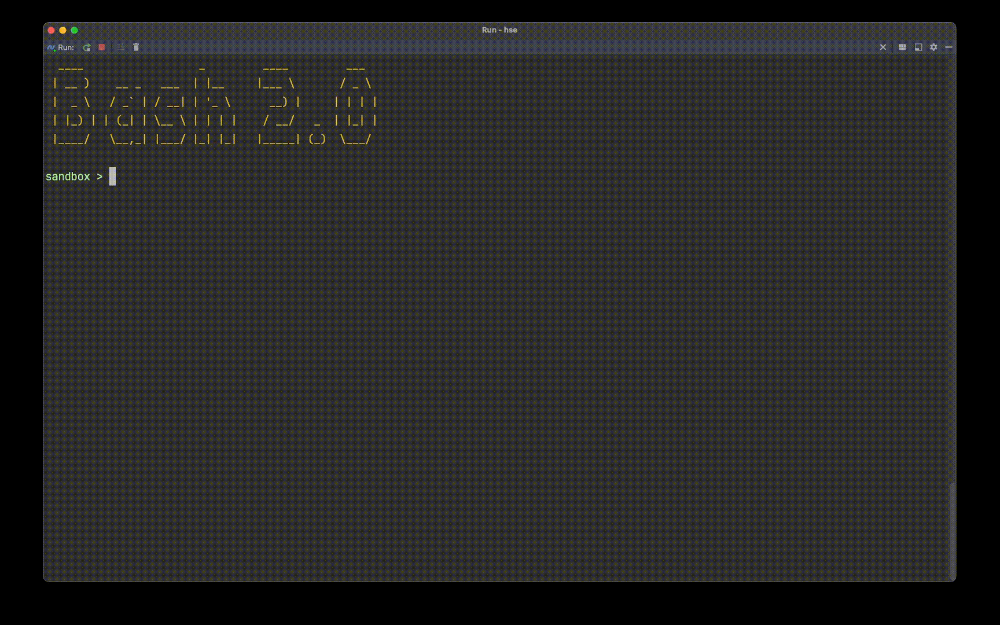

# Ultimate aka linux terminal

## Basic guide (ConsoleEngine by [@otter18](https://github.com/otter18))

- enter command. press `enter` to execute command
- use `tab` to autocomplete commands and paths
- use `arrowUp` & `arrowDown` to navigate throw commands history

## Available commands

| **Command** | **Syntax**                                                                                                            | **Flags**                                                                                                                                   | **Desc**                                                                                                                                                        | Author                                                     |
|-------------|:----------------------------------------------------------------------------------------------------------------------|:--------------------------------------------------------------------------------------------------------------------------------------------|:----------------------------------------------------------------------------------------------------------------------------------------------------------------|------------------------------------------------------------|
| cd          | `cd {path}`                                                                                                           |                                                                                                                                             | The path can be absolute or relative.                                                                                                                           | [@tothandras-hse](https://github.com/tothandras-hse)       |
| ls          | `ls [--flags]`                                                                                                                      | `-I` list file's inode index number  `-s` list file size  `-t` list creation time & data   `-S` sort by file size                                                                                                                                           |Outputs a list of folders and files in currentDir 🙉                                                                                                                                                               | [@a1n1a1s1t1a1s1i1a]🤸‍♀️(https://github.com/a1n1a1s1t1a1s1i1a) |
| cat         |          🙉                                                                                                             | `-n` numerates all lines of result `-s` delete duplicating empty lines `-P=x` set page size equal to x `-p=x`  print page number x | the number of output lines can be less than x when using `-s` because cat first chooses the required number of lines and only after that deletes unneeded lines | [@userviktoriuss](https://github.com/userviktoriuss)       |
| mkdir       |                                                                                                                       |                                                                                                                                             |                                                                                                                                                                 | [@MatveyR](https://github.com/MatveyR)                     |
| touch       |                                                                                                                       |                                                                                                                                             |                                                                                                                                                                 | [@MatveyR](https://github.com/MatveyR)                     |
| cp          | `cp from_file1 to_file2` `cp from_file1 from_file2 ... from_fileN to_directory`  `cp -r from_path1 to_path2` | `-r` copy folder recursively                                                                                                                | Copies file and folders                                                                                                                                         | [@AleksaKhruleva](https://github.com/AleksaKhruleva)       |
| rm          | `rm file1 file2 ... fileN` `rm -r path1 path2 ... pathN`                                                           | `-r` delete folder recursively                                                                                                              | Deletes file and folders                                                                                                                                        | [@AleksaKhruleva](https://github.com/AleksaKhruleva)       |
| tree        | `tree` `tree <depth>`                                                                                              |                                                                                                                                             | Outputs file tree. Depth can be specified.                                                                                                                      | [@otter18](https://github.com/otter18)                     |
| foxsay      | `foxsay <message>`                                                                                                    |                                                                                                                                             | What does the fox say?... 🎵🎵🎵                                                                                                                                | [@otter18](https://github.com/otter18)                     |
| echo        | `echo <text>` `echo {text} > {file}`                                                                               |                                                                                                                                             | Just prints out input text                                                                                                                                      | [@otter18](https://github.com/otter18)                     |
| help        | `help` `help <command>`                                                                                            |                                                                                                                                             | outputs help message                                                                                                                                            | [@otter18](https://github.com/otter18)                     |
| exit        | `exit`                                                                                                                |                                                                                                                                             | exit terminal                                                                                                                                                   | [@otter18](https://github.com/otter18)                     |
